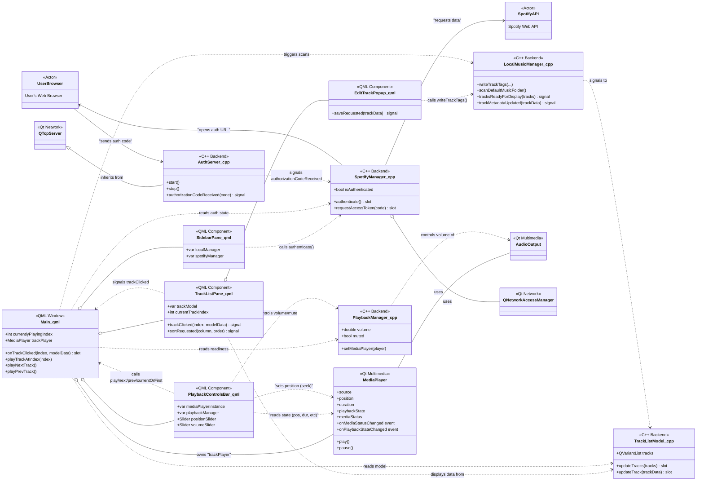

# Librify: The best offline music player for PC and Android

A modern, cross-platform desktop music player built with C++ and Qt/QML, designed to seamlessly blend your local music library with Spotify streaming.

<!-- 💡 TODO: Add a real screenshot of your application and update the path! -->

## ✨ Core Features

*   **Hybrid Music Library**: Access and play tracks from your local folders and your Spotify account in one unified interface.
*   **Modern & Responsive UI**: A fluid and intuitive user interface built with QML, ensuring a great experience on any desktop and android device.
*   **Local Metadata Editing**: Easily edit the tags (artist, album, title, cover art) of your local music files directly within the app.
*   **Secure Spotify Integration**: Uses a standard OAuth2 flow with a local server to securely authenticate with the Spotify Web API.
*   **Cross-Platform**: Built on the Qt framework for native performance on Windows, Android, and Linux.

## 🏛️ System Architecture

This project is designed with a clear separation between the **QML-based frontend** and the **C++ backend**, communicating through Qt's robust signals and slots mechanism. This ensures a responsive UI while heavy lifting like file I/O and network requests are handled efficiently in the background.

The diagram below illustrates the high-level interaction between the main components, UI elements, backend managers, and external services.

### Class Diagram

